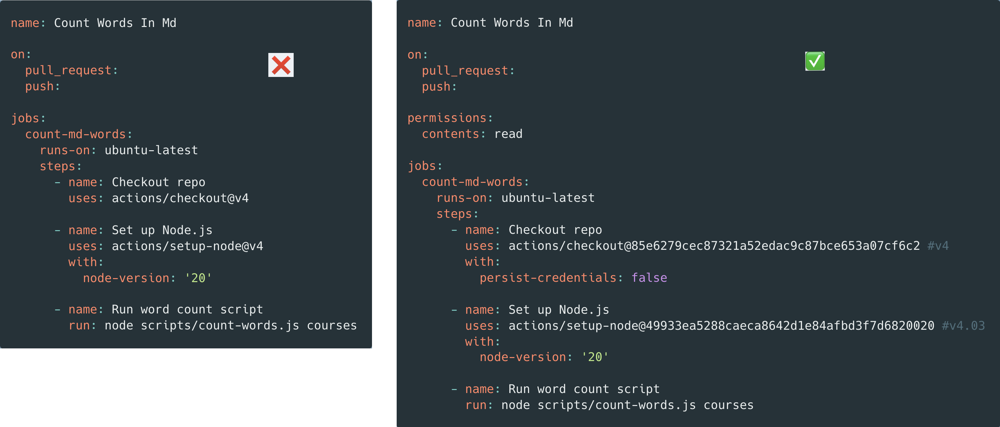

In the last few years, GitHub Actions have become a productivity hack for DevOps engineers, allowing them to automate deployments, code execution, and more. However, it also introduced new attack vectors into a codebase that, if not detected, could lead to potential security threats.

---

Let's compare these two GitHub Actions, which at first sight, perform the same action (count words in the repo with a python script) but with a few key differences, providing more robust security.

The security strategies used in this workflow are:

1. **Limiting** the GitHub workflow permission access (only to `contents: read`)

2. Using a **specific commit** hash when using third-party dependencies (to avoid injecting new vulnerabilities in newer versions)

3. [**Avoiding** storing $GITHUB_TOKEN in generated artifacts](https://unit42.paloaltonetworks.com/github-repo-artifacts-leak-tokens/) (with `persist-credentials: false`).

Finally, while it's important to know what these security threats look like, you can also use a tool like [_Zizmor_](https://github.com/woodruffw/zizmor) to help you detect them (especially in larger codebases).
